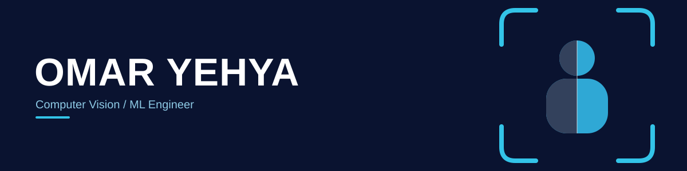

### Stack

### What I work on

Production CV work: TensorRT/CUDA inference pipelines, YOLO detection, facial recognition (InsightFace/ArcFace), ANPR (CRNN+CTC OCR), and multi-object tracking.

Currently building a computer vision platform:
- Custom C++/pybind11 RTSP decoder + TensorRT inference core
- ByteTrack multi-object tracking with two-line hysteresis zone counting
- gRPC control plane over a POSIX shared-memory data plane, serving multiple downstream consumers from a single pipeline
- FastAPI/PostgreSQL backend, Flutter mobile client
- Offline Ed25519-based licensing, per-client Cloudflare Tunnel deployment

### Pinned

| Repo | What it is |
|---|---|
| [multistream-trt](https://github.com/omar675675/multistream-trt) | Multi-stream TensorRT inference pipeline |
| [facial-recognition](https://github.com/omar675675/facial-recognition) | InsightFace/ArcFace facial recognition pipeline |
| [cv-platform-capabilities](https://github.com/omar675675/cv-platform-capabilities) | ANPR, counting, and access-control modules |

### Background

BS Electrical & Electronics Engineering (2020) → moved into AI/CV work in Oct 2023. CS50 AI with Python, CS50 Introduction to Programming with Python.

### Contact

